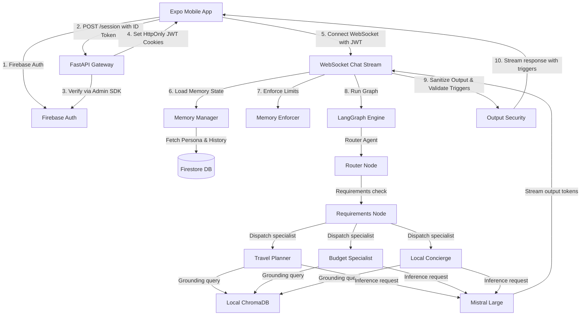

# Touri Architecture Audit Report

**Audit Date:** August 4, 2026  
**Auditor:** Lead Systems Architect  
**Overall Architecture Score:** **93/100**  

---

## 1. System Topology & Data Flow
The Touri application is split into a cross-platform React Native + Expo frontend and a high-performance Python FastAPI backend. The agentic workflow is powered by LangGraph, grounded by a local ChromaDB instance, and executed by Mistral AI.

---

## 2. LangGraph Multi-Agent Design
The LangGraph structure uses a conditional routing layout:
- **`memory` Node:** Fetches rolling summaries and preferences from Firestore.
- **`enforcer` Node:** Restricts agents from asking questions for already resolved requirements.
- **`router` Node:** Decides the user's intent (`trip_planning`, `budget_query`, etc.) and detects prompt injections.
- **`requirements` Node:** Evaluates if mandatory parameters (destination, duration) are missing, transitioning to `needs_info` to prompt for structured question responses if needed.
- **Specialist Nodes (`planner`, `budget`, `concierge`):** Process queries using retrieved context and return structured markdown plans or JSON schema triggers.

---

## 3. Storage & Integration Layers
- **Database (Firestore):** Users, chats, trips, pins, and preferences are organized into hierarchical subcollections under `users/{userId}`. Writable permissions are verified using security rules.
- **RAG Engine (ChromaDB):** Loaded as a local persistent client under `backend/data/chroma_db/`. Embeddings utilize the multilingual `paraphrase-multilingual-MiniLM-L12-v2` model, allowing cross-lingual queries (English/Arabic) to map to a single index.
- **LLM Integrations (Mistral):** Uses the `mistral-large-latest` model for reasoning-heavy planning and `mistral-small-latest` for streaming echoes and quick routing checks.
